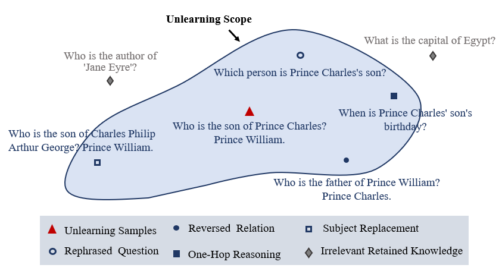

# UGBench

This repository contains the official implementation of the paper "Erasing Without Remembering: Safeguarding Knowledge Forgetting in Large Language Models".


## Overview

**UGBench** is a generalisation evaluation benchmark tailored for LLM-based machine unlearning. \bench\ provides an unbiased assessment of existing methods in forgetting in-scope unlearning samples. The benchmark spans three data domains: two widely-used machine unlearning datasets, TOFU and the Harry Potter books, as well as a popular model editing dataset, ZsRE. Evaluations are performed on 14 existing methods using two language models of different scales, Phi-1.3B and LLaMA2-7B. 

Despite significant progress in LLM-based unlearning, we identify an embarrassingly simple yet critical dilemma: *existing machine unlearning methods consistently exhibit a lack of generalisation.* 

To better illustrate, we introduce an **unlearning scope**, encompassing all the knowledge that unlearned models are expected to forget, such as paraphrased versions, reversed relations, one-hop questions, and those with substituted subjects.

<p align="center">
  
</p>


**Requirements**

```
conda create -n unlearn python=3.8.19
conda activate unlearn
pip install -r requirements.txt
``` 

The code supports fourteen unlearning methods, including: ["grad_ascent," "grad_ascent+kl," "grad_ascent+gd," "dpo," "dpo+kl," "dpo+gd," "npo," "npo+kl," "npo+gd," "task_vector," "ULD," "WHP," "icl," and "PerMU"]. 

Specify the name of your testing method in the `forget_xxx.sh` file.

```
export Forget_Loss=("PerMU"); 
```

When tested on TOFU, we use the checkpoints of the pre-trained target model from the [TOFU Leaderboard](https://huggingface.co/spaces/locuslab/tofu\_leaderboard). For the Harry Potter and ZsRE datasets, you can download the pre-trained model from Hugging Face. Place the model to be unlearned in the `./save_model/` directory and update its specific name in the `model_config.yaml` file.

Model | Link
|----------|:------------------------------:|
| harry_phi | |
| harry_llama | |
| zsre_phi | |
| zsre_llama | |


**Running the Code**

Unlearning on TOFU dataset: 

```
bash scripts/forget_tofu.sh
```

Unlearning on Harry Potter dataset: 

```
bash scripts/forget_harry.sh
```

Unlearning on ZSRE dataset: 

```
bash scripts/forget_zsre.sh
```


**Integrating a New Model**

To unlearn a new model, add the model configuration to `model_config.yaml`, then fine-tune the model using "finetune.sh".

If our implementation and paper are helpful, please consider citing our work.


